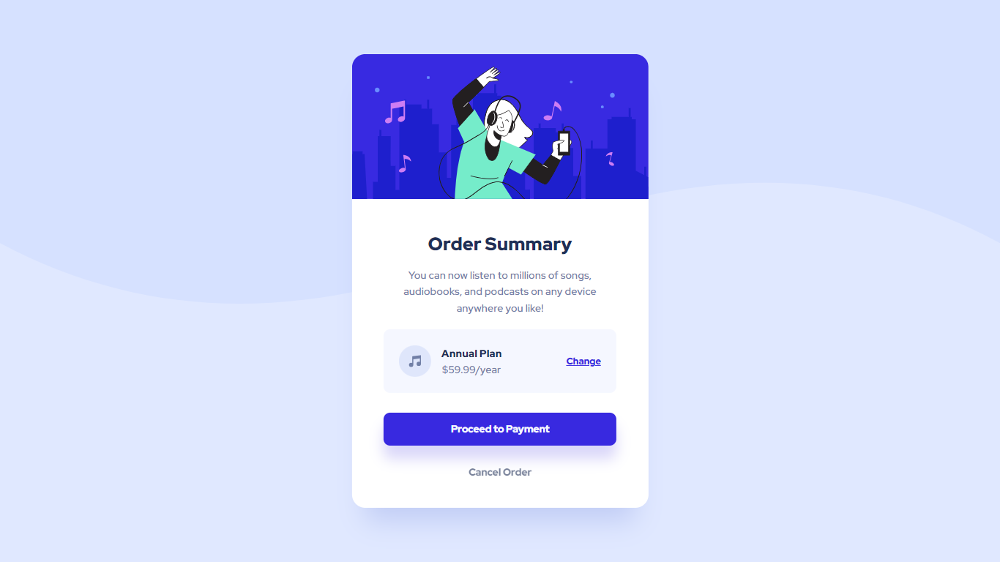

# Frontend Mentor - Order summary card solution

This is a solution to
the [Order summary card challenge on Frontend Mentor](https://www.frontendmentor.io/challenges/order-summary-component-QlPmajDUj).  
Frontend Mentor challenges help you improve your coding skills by building realistic projects.

## Table of contents

- [Overview](#overview)
    - [The challenge](#the-challenge)
    - [Screenshot](#screenshot)
    - [Links](#links)
- [My process](#my-process)
    - [Built with](#built-with)
    - [What I learned](#what-i-learned)
    - [Useful resources](#useful-resources)
- [Author](#author)

## Overview

### The challenge

Users should be able to:

- See hover states for interactive elements

### Screenshot



### Links

- Solution URL: [Add solution URL here](https://your-solution-url.com)
- Live Site URL: [Add live site URL here](https://your-live-site-url.com)

## My process

### Built with

- Semantic HTML5 markup
- CSS custom properties
- Flexbox

### What I learned

- I learned about CSS variables, which allowed me to easily customize the styling of my project.

  ```css
  :root {
      --primary-pale-blue: hsl(225, 100%, 94%);
      --primary-bright-blue: hsl(245, 75%, 52%);
  }
  ```

- I discovered the `clamp()` function in CSS, which helped me create responsive font sizes based on minimum, preferred,
  and maximum sizes.

  ```css
  h1 {
      font-size: clamp(1.375rem, 1.243rem + 0.563vw, 1.75rem);
  }
 
  .card-plan {
      padding: clamp(1em, 0.824em + 0.751vw, 1.5em);
  }
  ```

- I explored the `margin-block` and `margin-inline` properties, which gave me more control over the layout and spacing
  of elements in my design.

  ```css
  .card {
      margin-inline: 24px;
  }

  .card-cta a:first-child {
      margin-block: clamp(2em, 2.176em + -0.751vw, 1.5em);
  }
  ```


### Useful resources

- [Clamp Calculator](https://www.marcbacon.com/tools/clamp-calculator/) - This website was very helpful for calculating
  the amount of clamps needed for my project. I particularly appreciated this handy tool and will use it in the future
  for my woodworking projects.

## Author

- Website - [Add your name here](https://www.your-site.com)
- Frontend Mentor - [@lamine](https://www.frontendmentor.io/profile/LamineGitHub)

